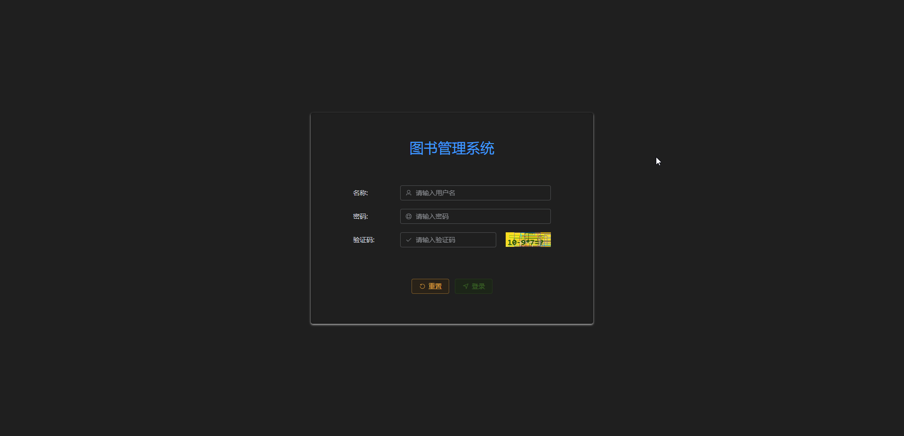
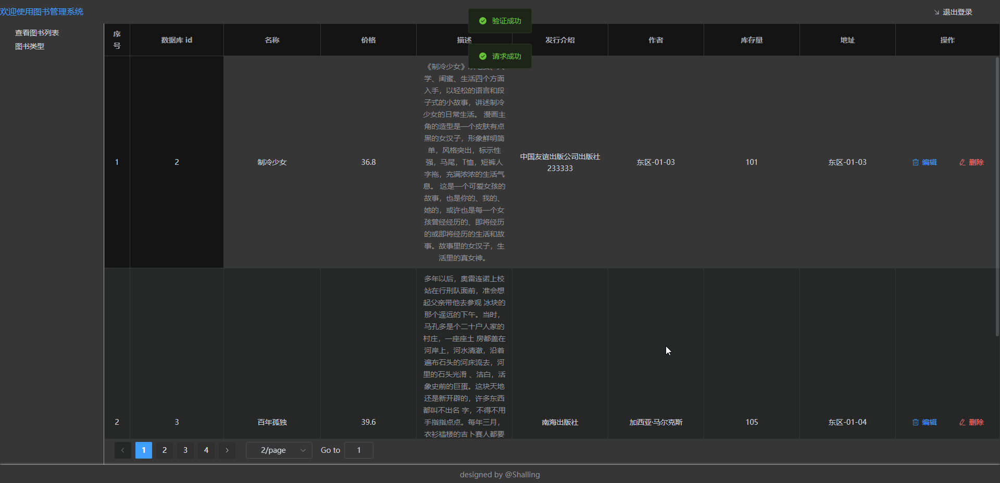

# 一套很简单的 Servlet REST 注解功能实现

- ~~实现一个糟糕的不太优雅的 rest 注解功能🥲~~
- 为了区分, 所有实现的注解都添加 `Left` 后缀做为区分🤣
- 做的真的很烂, 勿喷, 勿喷...😶‍🌫️
- ~~这个系统没有完全写完, 因为懒得继续改进了, 费时间和不讨好🤣(对于普通课后作业)~~

## 实现的功能

- 例如
  1. rest 风格的注解(提供了 post 和 get), 以及提供 `@Post 注解用于提取前端传递的 json 数据`
     
  2. 相对简单的配置(application.yml)
     
  3. 提供一个简单的数据库连接池实现(支持线程安全)

## Note

- ~~赶工作业项目, 缺乏封装以及测试, 没有足够时间取设计,存在诸多不足和缺陷, 前后端都缺乏工程化上规范开发,
  单纯图一🤣乐...~~
- 诸多缺陷, 勿喷🥲....

## 结合前端实现的简单业务功能(前后端分离, 神奇的图书管理系统模块[doge])

- 登录
  

- 数展示以及支持分页
  

- 编辑
  

- 删除
  

- 基于有效时长的 token 权限认证, 如果没通过认证, 则前后端共同结合, 阻止访问对应页面和接口
  

- 退出登录
  
